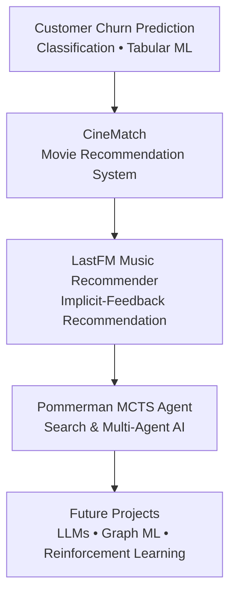

# Hi, I'm Saba 👋

🎓 BSc Artificial Intelligence Student at Johannes Kepler University Linz (JKU), Austria

I'm passionate about building practical machine learning systems that solve real-world problems. My interests include recommender systems, machine learning, data mining, search algorithms and intelligent decision making.

Currently looking for an **AI / Machine Learning Internship**.

---

# 🚀 AI Project Journey

---

# ⭐ Featured Projects

## 🎵 LastFM Music Recommender

My largest recommendation-system project built with a modular architecture for implicit-feedback music recommendation.

**Highlights**

- Popularity Recommender
- ItemKNN Collaborative Filtering
- Content-Based Filtering
- Alternating Least Squares (ALS)
- Hybrid Recommendation
- Offline Evaluation Pipeline
- Performance Visualization
- GitHub Actions CI
- 36 Unit Tests
- Modular Python Package

**Tech Stack**

Python • Pandas • NumPy • Scikit-learn • Pytest • GitHub Actions

➡️ Repository:
https://github.com/saba-zia/lastfm-music-recommender

---

## 🎬 CineMatch

Movie recommendation system built on the MovieLens dataset using collaborative filtering and cosine similarity with TMDB API integration.

**Highlights**

- Item-based Collaborative Filtering
- Cosine Similarity
- Movie Metadata
- Streamlit Deployment
- Recommendation Interface

➡️ Repository:
https://github.com/saba-zia/movie-recommendation-system

---

## 📊 Customer Churn Prediction

End-to-end machine learning project predicting customer churn using classification models and model evaluation techniques.

**Highlights**

- Data Cleaning
- Feature Engineering
- Logistic Regression
- ROC/AUC Analysis
- Threshold Optimization
- Streamlit Deployment

➡️ Repository:
https://github.com/saba-zia/customer-churn-prediction

---

## 🤖 Pommerman MCTS Agent

University AI project implementing a Monte Carlo Tree Search agent for the Pommerman multi-agent environment.

**Highlights**

- Monte Carlo Tree Search
- Forward Model Simulation
- Heuristic Evaluation
- Multi-Agent Search

➡️ Repository:
https://github.com/saba-zia/pommerman-mcts-agent

---

# 🛠 Technical Skills

### Languages

- Python
- SQL
- C++

### Machine Learning

- Scikit-learn
- Recommendation Systems
- Classification
- Feature Engineering
- Model Evaluation

### Data

- Pandas
- NumPy
- Data Visualization

### Tools

- Git
- GitHub
- GitHub Actions
- Pytest
- Streamlit
- Jupyter Notebook

---

# 📚 Currently Learning

- Advanced Recommender Systems
- Large Language Models (LLMs)
- Graph Machine Learning
- Reinforcement Learning
- MLOps

---

# 📫 Contact

- LinkedIn: https://linkedin.com/in/YOUR-LINKEDIN
- GitHub: https://github.com/saba-zia
