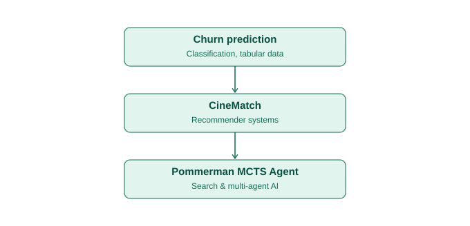

# Hi, I'm Saba 👋

BSc Artificial Intelligence student at Johannes Kepler University Linz (JKU), based in Linz, Austria.

I build and publish self-driven machine learning projects, working across classification problems, recommender systems, and search-based decision making. Currently looking for an AI internship or job opportunity.

## My Project Roadmap

## Projects

**[Customer Churn Prediction](https://github.com/saba-zia/customer-churn-prediction)** — *Self-driven project*
End-to-end classification project on the Telco Customer Churn dataset — logistic regression, ROC/AUC analysis, threshold tuning, deployed with Streamlit.

**[CineMatch](https://github.com/saba-zia/movie-recommendation-system)** — *Self-driven project*
Movie recommender system built on the MovieLens dataset using item-based collaborative filtering and cosine similarity, with TMDB API integration, deployed with Streamlit.

**[Pommerman MCTS Agent](https://github.com/saba-zia/pommerman-mcts-agent)** — *University coursework project (JKU)*
Team project building a Monte Carlo Tree Search agent for the Pommerman multi-agent environment, with forward-model simulation and bomb-safety heuristics.

## Skills

Python · Pandas · Scikit-learn · Machine Learning · Recommender Systems · Search Algorithms (MCTS) · Streamlit · Git & GitHub

## Contact

🔗 [LinkedIn](https://www.linkedin.com/in/saba-zia-naserani/)
