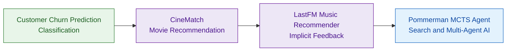

## My Project Roadmap

The roadmap represents my progression from supervised machine learning to recommender systems and search-based artificial intelligence.

---

## Featured Projects

### 📊 [Customer Churn Prediction](https://github.com/saba-zia/customer-churn-prediction)

**End-to-end classification project for telecom customer churn prediction.**

- Logistic regression and model evaluation
- ROC-AUC analysis
- Decision-threshold tuning
- Data preprocessing and exploratory analysis
- Interactive Streamlit deployment

---

### 🎬 [CineMatch](https://github.com/saba-zia/movie-recommendation-system)

**Movie recommendation system built using the MovieLens dataset.**

- Item-based collaborative filtering
- Cosine similarity
- TMDB API integration
- Interactive Streamlit application
- Personalized movie recommendations

---

### 🎵 [LastFM Music Recommender](https://github.com/saba-zia/lastfm-music-recommender)

**Modular music recommendation system for implicit-feedback data.**

- Popularity, ItemKNN, Content-Based, ALS and Hybrid models
- Unified model interface
- Offline evaluation and performance visualization
- 36 automated unit tests
- Continuous Integration with GitHub Actions
- Professional Python packaging with `pyproject.toml`

---

### 🤖 [Pommerman MCTS Agent](https://github.com/saba-zia/pommerman-mcts-agent)

**Monte Carlo Tree Search agent for a multi-agent game environment.**

- Forward-model simulation
- Search-based decision making
- Bomb-safety heuristics
- Multi-agent environment
- University team project at JKU

---

## Technical Skills

**Languages and Data**

`Python` · `Pandas` · `NumPy` · `SciPy`

**Machine Learning**

`Scikit-learn` · `Classification` · `Recommender Systems` · `Collaborative Filtering` · `Content-Based Filtering`

**AI and Algorithms**

`Monte Carlo Tree Search` · `Search Algorithms` · `Multi-Agent AI`

**Engineering**

`Git` · `GitHub` · `GitHub Actions` · `Pytest` · `Streamlit` · `Python Packaging`
